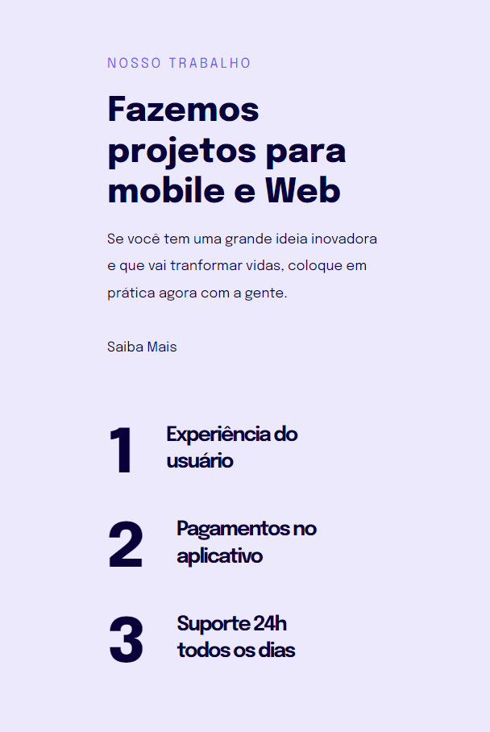

<h1 align="center"> Projeto Extra Explorer </h1>

Desenvolvido durante as aulas do Explorer na plataforma da Rocketseat.

  <a href="#-tecnologias">Tecnologias</a>&nbsp;&nbsp;&nbsp;|&nbsp;&nbsp;&nbsp;
  <a href="#-projeto">Projeto</a>&nbsp;&nbsp;&nbsp;|&nbsp;&nbsp;&nbsp;
  <a href="#memo-licença">Licença</a>

  

 

## Tecnologias

Esse projeto foi desenvolvido com as seguintes tecnologias:

- HTML e CSS
- Git e Github
- Figma

## Projeto

Esse projeto é uma homepage simples de um desenvolvedor web e mobile, onde foi reforçado os conceitos de acessibilidade utilizando o metodo "mobile first" que aprendi durante as aulas.

## Licença

Esse projeto está sob a licença MIT.

---